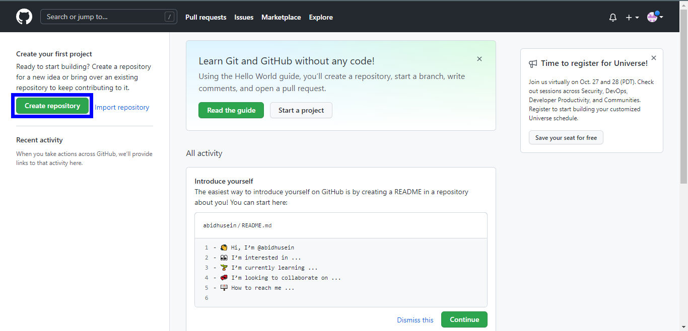
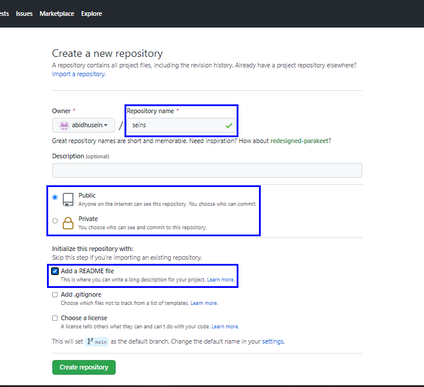
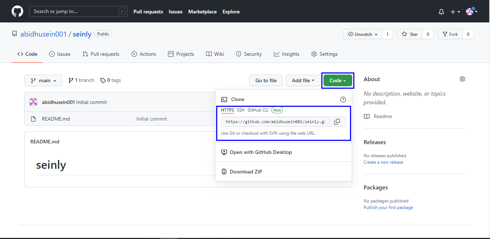
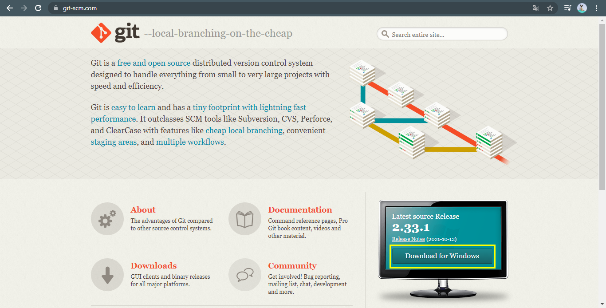

# seins
## Tutorial

### Cara Membuat Akun Github
- Buka [Github](https://github.com)

- Jika Belum mendaftar klik Regiter/Sign up 

- Jika sudah mendaftar silahkan klik Masuk/Sign in 

- Jika sudah Sign in muncul tampilan seperti tampilan dibawah ini

- Kemudian klik Create repository

- kemudian isi Repository name

- deskripsi (optional) boleh di isi boleh tidak

- Ceklist Add a README file

- kemudian klik Create repository seperti gambar dibawah

Setelah muncul tampilan seperti gambar dibawah

- Klik Code kemudian kalian bisa pilih HTTPS, SSH, Github, atau CLI. Lalu copy link yang tersedia

- Jika kalian belum instal git-scm silahkan, instal terlebih dahulu (skip saja jika sudah instal)
- [Git-scm](https://git-scm.com/) klik Download for Windows
- Jika sudah didownload silahkan instal seperti biasa, klik next saja

