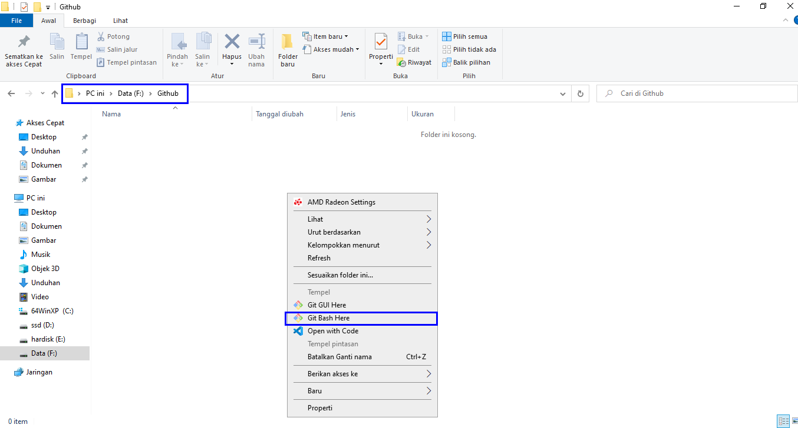
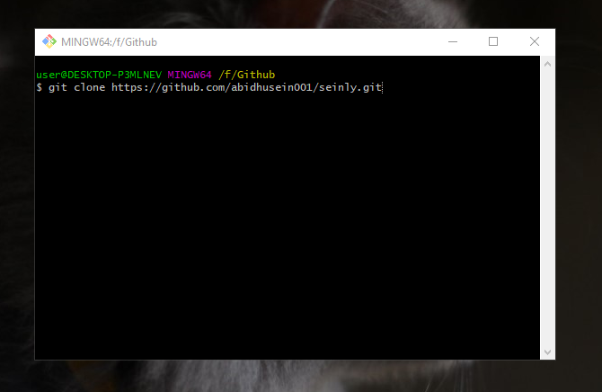
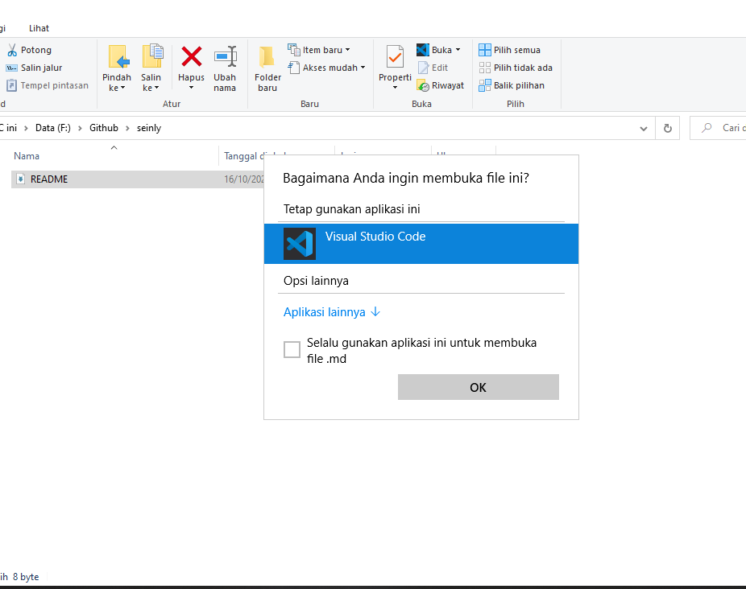

## Latihan 1
## Tutorial Github

<p align="center">

</p>
<p align="center">
<a href="https://api.whatsapp.com/send?phone=6281219019084"></a></p>
<p align="center">
<p align="center">
<a href="https://github.com/abidhusein"></a>
<p align="center">


### Cara Membuat Akun Github
- Buka [Github](https://github.com)<p>
- Jika Belum mendaftar klik Regiter/Sign up <p>
- Jika sudah mendaftar silahkan klik Masuk/Sign in <p>


- Jika sudah Sign in muncul tampilan seperti tampilan dibawah ini<p>
- Kemudian klik Create repository<p>


- kemudian isi Repository name<p>
- deskripsi (optional) boleh di isi boleh tidak<p>
- Ceklist Add a README file<p>
- kemudian klik Create repository seperti gambar dibawah<p>


Setelah muncul tampilan seperti gambar dibawah<p>
- Klik Code kemudian kalian bisa pilih HTTPS, SSH, Github, atau CLI. Lalu copy link yang tersedia<p>


- Jika kalian belum instal git-scm silahkan, instal terlebih dahulu (skip saja jika sudah instal)
- [Git-scm](https://git-scm.com/) klik Download for Windows
- Jika sudah didownload silahkan instal seperti biasa, klik next saja


- Buat satu folder kosong untuk directory kerja
- Kemudian klik kanan pada mouse pilih "Git Bash Here"



- Kemudian copy link HTTPS Github kalian
```bash
> git clone 'link Github'
```
- Tekan Enter pada keyboard



- Kemudian muncul file README.md di file kalian
- Klik kanan pada mouse, lalu pilih open with pilih "Visual Studio Code"
- Jika kalian belum instal "Visual Studio Code" kalian bisa download [VCS](https://code.visualstudio.com/)
- Tutorial cara instal [Video instalasi VCS](https://www.youtube.com/watch?v=OSmaWPSgvTQ)



Setelah terbuka Visual Code Studio, pastikan kalian koding di file README.md</p>
- Edit file README.md, lalu jangan lupa  di save (ctrl+s)
- Setelah itu buka Git Bash yang sebelumnya
```bash
> git add README.md
> git commit -m "Dekripsi"
> git push -u origin main
```
